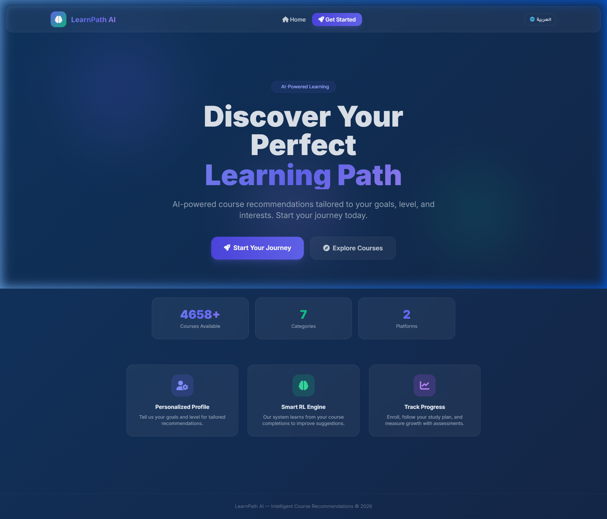
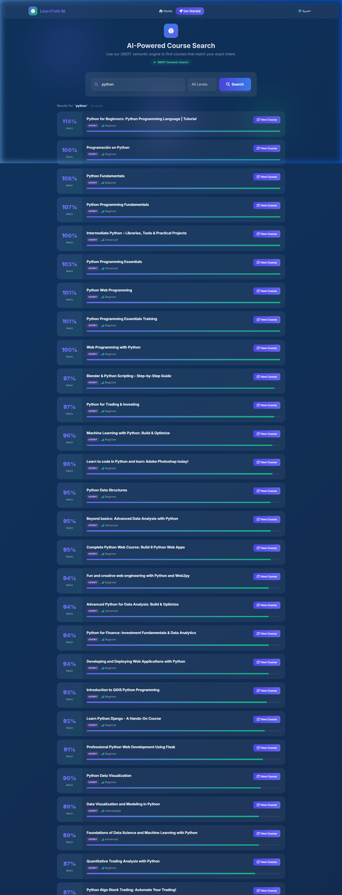
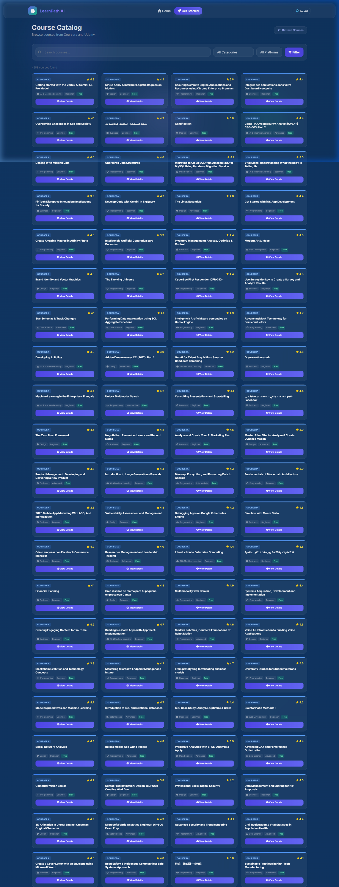

# LearnPath AI: Intelligent Course Navigator 🚀

LearnPath AI is a sophisticated Course Recommendation System that uses semantic search (SBERT) and Reinforcement Learning (RL) to personalizes learning journeys for students. 



## 🌟 Key Features

- **AI-Powered Semantic Search**: Uses local SBERT (Sentence-BERT) embeddings to find courses based on user intent rather than just keywords.
- **Personalized Recommendations**: A weighted interest engine that evolves based on your course completions and feedback.
- **Bilingual Support**: Full English and Arabic interface support.
- **Interactive Assessments**: Pre and Post-course knowledge assessments to track your learning growth.
- **Smart Study Plans**: Automatically generates a structured calendar based on your availability (Daily, Weekdays, Weekends, etc.).

## 📸 Screenshots

### AI Search Results


### Course Catalog


## 🛠️ Technology Stack

- **Frontend**: Responsive HTML5, Vanilla CSS, and JavaScript.
- **Backend**: Python with Flask.
- **AI Models**: SBERT (Sentence-BERT) for embeddings and semantic similarity.
- **Database**: JSON-based storage for user profiles and course metadata.

## 📂 Project Structure

- `course_rec/`: The main Flask application and UI templates.
- `src/`: Core recommendation logic and SBERT integration.
- `data/`: Extracted course data from platforms like Udemy and Coursera.
- `models/`: (Optional) Local model weights and configuration.
- `notebooks/`: Data exploration and model testing scripts.

## 🚀 Getting Started

1. **Install dependencies**:
   ```bash
   pip install -r requirements.txt
   ```
2. **Run the application**:
   ```bash
   python course_rec/app.py
   ```
3. Open `http://localhost:5000` in your browser.

---
*Developed as a Capstone Project by Hamza Abu Saleh.*
